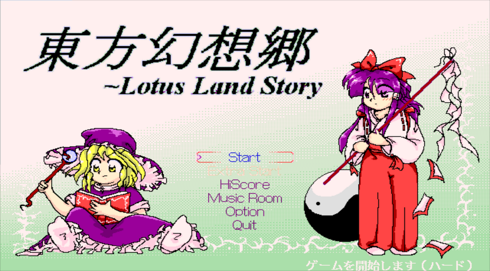
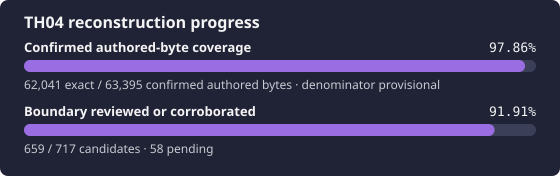

# 東方幻想郷 ～ Lotus Land Story

<p align="center">
  
</p>

<p align="center">
  
</p>

This repository is an agent-first reconstruction of the original Japanese
PC-98 release of **Touhou 4: Lotus Land Story (TH04)**.  The immediate goal is a
reproducible, evidence-backed source reconstruction of `OP.EXE`, `MAIN.EXE`,
`MAINE.EXE`, and `ZUN.COM`.  Original executables and game data are supplied
locally by the owner and are never committed.

The framework deliberately does not copy ReC98's workflow.  ReC98 is an
important source of PC-98, Borland, and game-specific knowledge; N0zoM1z0's
TH08/TH095/TH105 repositories are useful control-plane references.  This
project combines those lessons with stricter machine-readable evidence and a
multi-dimensional Oracle stack designed for short, resumable agent sessions.
Nothing from an upstream reconstruction is accepted on reputation: imported
source must pass this repository's own target, build, layout, relocation, raw-
byte, and replay gates.

## Exact targets

Supply your own legal copy.  The importer selects the Japanese `zun.hdi` and
requires these artifacts:

| Artifact | Size | SHA-256 |
| --- | ---: | --- |
| `OP.EXE` | 42,290 | `8fc3b67fa8470de15b4f2844d5623d0a93d7922fac16d82a25a90a378b516b0f` |
| `MAIN.EXE` | 156,258 | `077440a3c4e9ab52e72e9bae411276c47edc11995b5c2b83dfc83fbc039dc58b` |
| `MAINE.EXE` | 38,035 | `670de6ba907a2edbc1592de810acd92e5b89541d3dc35b70210171166d1713f8` |
| `ZUN.COM` | 7,754 | `0a12e9a489d3b704a77cf04ca3062ee48f298a9df6d237dc7dad46986e2d116e` |

These hashes currently have `candidate-local-attested` provenance: they
identify the supplied Japanese image exactly, while independent pristine-dump
confirmation remains open.  That qualification is kept separate from whether
a candidate build exactly matches the pinned bytes.

## Source layout

As in the TH08 reconstruction, `src/` is organized as product code rather than
as a progress report. Current reconstructed code is under `src/main/` and its
engine subsystems. Future artifact-owned code belongs under `src/op/`,
`src/maine/`, or `src/zun/`; code proved shared between TH04 artifacts belongs
under `src/shared/`. Exact, structural, and source-present state is tracked in
the CSV ledgers, never with `exact/`, `partials/`, or `modules/` directories.

The intended build consumes checked-in TH04 source and headers plus the pinned
Borland/TASM/TLINK environment and documented libraries. Direct ReC98 and
TH01/TH02/TH03/TH05 includes are quarantined behind the reusable
[`compat/rec98/`](compat/rec98/) forwarding layer and are never authored
progress. The current reconstruction is not yet a complete standalone build:
the strict exact replay still uses pinned ReC98 as clean build scaffolding for
bounded recovered units. See [`docs/ARCHITECTURE.md`](docs/ARCHITECTURE.md) for
the ownership and migration rules.

## Fresh machine setup

The calibrated host was Debian 12 x86-64 with Python 3.11 and Wine 8.0. The
repository does not hard-gate a new machine on the distro's Wine binary hash;
the portable gates are the pinned Borland/MS-DOS Player bytes, successful
execution probes, cold determinism, and final exact comparison. Allow roughly
6 GiB of free space if installing both tool stacks and retaining cold builds.

```bash
git clone https://github.com/N0zoM1z0/th04.git
cd th04
sudo apt update
sudo apt install git python3 unar wine wine64 p7zip-full mtools curl wget \
  ca-certificates tar unzip
```

PC-98 execution is optional for static reconstruction. To provision the
headless runtime smoke baseline as well, install `dosbox-x`; see
[`docs/RUNTIME.md`](docs/RUNTIME.md) for the pinned host identity, retained-HDI
flow, and the boundary between a startup smoke and runtime evidence.

Run the one-line reference clone command in the reference section below, then:

```bash
python3 scripts/import_targets.py /path/to/your/legal-copy.rar \
  --include-all-games-smoke \
  --retain-runtime-image
bash scripts/bootstrap_toolchain.sh
bash scripts/bootstrap_analysis_toolchain.sh
python3 scripts/ghidra.py th04-main import
python3 scripts/preflight.py
python3 scripts/ghidra.py th04-main check
python3 scripts/smoke_runtime.py --boot-image
python3 scripts/ci.py
```

All downloaded tools are under ignored `.tools/`; targets, Borland media,
builds, exports, and receipts are under ignored `.analysis/`; Ghidra databases
are under ignored `ghidra-project/`. No GUI step is required. Each bootstrap
refuses to overlay a partial installation, so move an incomplete private tree
aside and rerun rather than editing hashes.

## Daily quick start

```bash
python3 scripts/check_environment.py
python3 scripts/import_targets.py \
  /path/to/your/legal-copy.rar \
  --include-all-games-smoke
python3 scripts/preflight.py
python3 scripts/ghidra.py th04-main check
python3 scripts/smoke_oracles.py
```

The imported files live below `.analysis/targets/`.  They are ignored by Git.
The checked-in target manifest pins their expected size and digest.  A private
receipt additionally records the source archive and disk geometry.

For a candidate build:

```bash
python3 scripts/compare_artifacts.py \
  .analysis/targets/th04/main.exe build/th04/main.exe --json

# Export private relocation/address facts for an analysis backend.
python3 scripts/export_analysis_bundle.py th04-main --load-segment 0x2000

# Mine cross-game navigation candidates (never exact evidence).
python3 scripts/mine_shared_blocks.py th04-main th05-main-smoke
```

Exit status is zero only for raw byte identity.  Structural or
relocation-normalized similarities are diagnostic evidence, never a substitute
for exact acceptance.

## Reproduce the pinned reference checkouts

The six repositories inspected during framework bring-up are ignored local
references.  Clone and detach all of them at the analyzed revisions with this
single command:

```bash
mkdir -p _reference && git clone https://github.com/N0zoM1z0/th08.git _reference/th08 && git -C _reference/th08 checkout --detach bd54d865ebbc9f7291b355d152b16cc4b7f5be59 && git clone https://github.com/N0zoM1z0/th095.git _reference/th095 && git -C _reference/th095 checkout --detach 8adeea57830d63ad320a6c85be51f9069506ec34 && git clone https://github.com/N0zoM1z0/th105.git _reference/th105 && git -C _reference/th105 checkout --detach fa8a4149eeba27e9a1c78ab3bb03d970ef4f8266 && git clone https://github.com/nmlgc/ReC98.git _reference/ReC98 && git -C _reference/ReC98 checkout --detach b6ba5b0a529edbb31efdf8c0e939263804f8ee47 && git clone https://github.com/nmlgc/mzdiff.git _reference/mzdiff && git -C _reference/mzdiff checkout --detach 02603e1b070a1cfe5f9c580d49b9eb28617aeb4a && git clone https://github.com/tsdko/98imgtools.git _reference/98imgtools && git -C _reference/98imgtools checkout --detach 6c7a82a68addc5be2d4291a4bc98046a647b6235
```

Every checkout remains untrusted input.  Pinning makes analysis repeatable; it
does not promote upstream claims into local evidence.

## Download and install the build toolchain

The tested environment is Debian 12 x86-64 with Wine 8.0. Install the host
prerequisites from the fresh-machine section, then run the bootstrapper:

```bash
bash scripts/bootstrap_toolchain.sh
```

The script downloads Turbo C++ 4.0J installation media from the HTTP-only,
untrusted `http://pc98.shiz.me/software/borland-4.0j/` mirror and requires its
complete 61-file tree SHA-256 to be
`6e7e3c2734044bc799cbd4ad9645654bfd3a4f17ed29e3e2988c9dba1af350a`.
It downloads the Turbo Assembler 5.0 archive through WinWorld's
[`5.x` product page](https://winworldpc.com/product/turbo-assembler/5x) and
requires the published SHA-512
`0580f14adbb785e43ee3b057a5ec0417b3206b26fba4bda034140e7d6aa4947634dcbe167f337de2942fb4a3e3515e9eb829d6b666d31a64afe442111a070061`.
The local archive SHA-256 is
`94723cc2c882525dd561e4d35a9251b8fb992a0352c075ca5f97fff12bbc872f`.

Exact Borland/MS-DOS Player binaries, installed tree hashes,
configuration files, banners, and OMF producer strings are all pinned in
`config/toolchain.toml`.  The tools and media are proprietary and stay under
ignored `.analysis/`; users must obtain and use them under applicable rights.
The third-party URLs are provenance records, not legal or canonicality claims.
Host Wine file hashes are retained only as diagnostics from the calibrated
machine; a different host build is accepted only if the execution probes and
cold output Oracles pass.

The install uses an isolated Wine prefix and DOS-visible `C:\TC4` path because
the Borland DPMI loader fails with `Loader error (0000)` from this repository's
deep `Z:` path.  The required compiler configuration is `TURBOC.CFG`, not
`TCC.CFG`; its checked-in template supplies `C:\TC4\INCLUDE` and
`C:\TC4\LIB`.  Re-run the full identity and execution attestation at any time:

```bash
python3 scripts/attest_toolchain.py
```

This checks 16 configured acquisition/install/runtime surfaces: 14 portable
tool surfaces are required and two host Wine hashes are diagnostic. It also
requires two identical C-to-OMF-to-MZ and ASM-to-OMF rounds, valid OMF
framing/checksums, expected embedded producer and dependency records, and
successful execution. For an individual object, run
`python3 scripts/inspect_omf.py path/to/module.obj`.

Cold-build pinned ReC98 as an untrusted candidate, then run the strict and
known-vector checks across all five PC-98 games:

```bash
python3 scripts/cold_build_rec98.py --run-id cold-local-001
python3 scripts/survey_rec98_outputs.py \
  .analysis/builds/rec98-b6ba5b0a52/cold-local-001/source
python3 scripts/survey_rec98_outputs.py \
  .analysis/builds/rec98-b6ba5b0a52/cold-local-001/source \
  --gate calibration
```

For the pinned revision, the strict command intentionally exits 1: only TH01
`ZUNSOFT.COM`, TH02 `ZUN.COM`, and TH05 `ZUN.COM` are raw-exact (3/20).
ReC98's four TH04 candidates are all rejected by whole-file policy.
Calibration exits 0 only when the source archive, cold-build receipt, all 20
candidate bytes, every compact comparison dimension, all 416 valid OMF
objects, and the five narrowly normalized per-game object-set identities match
the checked-in baseline.  It never waives the strict gate.  Use
`scripts/compare_rec98_th01.py` for the focused TH01 policy differential.  See
[`docs/TOOLCHAIN.md`](docs/TOOLCHAIN.md) for the complete download/install
process, direct focused-probe commands, receipt contents, failure recovery, and
all full digests.  Add `--compact` to the survey for a roughly 47 KiB
agent-triage report instead of the roughly 1.5 MiB full difference receipt.

## Install and use headless Ghidra

Static analysis is pinned to **Ghidra 12.1.3** and **Eclipse Temurin JDK
21.0.12.1+1**. As in TH095, downloads and versioned installations live under
ignored `.tools/`, with stable `.tools/ghidra` and `.tools/jdk` symlinks;
private databases live under ignored `ghidra-project/`. Generated caches,
exports, and receipts live below `.analysis/ghidra/`.

```bash
sudo apt install ca-certificates curl python3 tar unzip
bash scripts/bootstrap_analysis_toolchain.sh

# Clean headless import plus independent PC-98 MZ database attestation.
python3 scripts/ghidra.py th04-main import

# Required read-only replay before target-dependent database work.
python3 scripts/ghidra.py th04-main check

# Positive and negative database-Oracle calibration.
python3 scripts/smoke_ghidra_oracle.py th04-main
```

The bootstrapper downloads the official Ghidra
`ghidra_12.1.3_PUBLIC_20260817.zip` and Temurin
`OpenJDK21U-jdk_x64_linux_hotspot_21.0.12.1_1.tar.gz`, verifies their pinned
sizes and SHA-256 digests, extracts the versioned trees, creates the stable
links, and checks the complete installed identities plus actual headless
execution. The workflow is intentionally headless-only; no GUI path is
provided.

The TH04 database Oracle goes beyond the PE-oriented reference check. It
independently verifies the complete imported `FileBytes`, MZ header overlay,
Ghidra's relocation-applied load image at segment `0x1000`, every relocation,
the exact header/load mapping partition with no extra target-backed aliases,
entry `CS:IP`, current-run timeout state, and sampled bytes. Ghidra's
inferred blocks and functions remain provisional and cannot satisfy an exact
gate. See [`docs/GHIDRA.md`](docs/GHIDRA.md) for exact URLs and hashes, the
`.tools/`/`ghidra-project/` layout, clean rebuild procedure, all commands,
failure recovery, loader limitations, and the TH01/TH04 calibration results.

## Project map

- `AGENTS.md` — mandatory target, evidence, safety, and session rules.
- `config/targets.toml` — legally supplied target identity and provenance.
- `config/oracles.toml` — Oracle definitions and exact-acceptance policy.
- `config/rec98_pc98_calibration.toml` — pinned untrusted all-game regression
  vector; never an exactness waiver.
- `config/units.csv` — bounded code/data ownership and reconstruction state.
- `config/th04_function_boundaries.csv` — all-artifact function observations,
  origin classification, confidence, and reconstruction routing.
- `config/evidence.csv` — replayable observations, commands, and digests.
- `config/hypotheses.csv` — falsifiable claims and their current disposition.
- `docs/ARCHITECTURE.md` — PC-98-specific architecture and address model.
- `docs/ORACLES.md` — independent Oracle stack and acceptance matrix.
- `docs/TOOLCHAIN.md` — build-chain acquisition, installation, attestation,
  use, and troubleshooting.
- `docs/GHIDRA.md` — pinned headless analysis installation, private project
  layout, MZ database attestation, calibration, and use.
- `docs/RUNTIME.md` — optional headless DOSBox-X install, attestation, private
  HDI boot smoke, and deterministic Runtime Oracle requirements.
- `docs/RE_WORKFLOW.md` — bounded agent loop.
- `docs/PROGRESS.md` — conservative source-present and exact-byte totals.
- `docs/BOUNDARY_REVIEW.md` — reviewed OP/MAIN/MAINE/ZUN boundary inventory and
  the reproducible DIET/Ghidra/MAP/TASM workflow.
- `docs/reconstruction/TH04_MAIN_EXACT_BATCH.md` — compact `MAIN.EXE`
  acceptance and cold-replay contract; live state remains ledger-derived.
- `docs/reconstruction/TH04_MAIN_FIXUP_CODEGEN_PROBES.md` — reusable negative
  compiler/TU/FIXUPP results for the remaining difficult units.
- `compat/rec98/README.md` — temporary, reusable boundary around unlocalized
  ReC98 declarations; never reconstructed-source progress.
- `docs/REFERENCE_ANALYSIS.md` — findings from TH08/TH095/TH105 and ReC98.
- `docs/KNOWLEDGE_BASE.md` — scoped durable facts, hazards, and negative results.
- `.agents/skills/` — task routers for RE, Oracle work, matching, and runtime.
- `scripts/` — target import, verification, comparison, status, and CI tools.
  Reusable whole-artifact boundary tools are grouped in
  `scripts/boundary_review/`.

## Status

The control plane, target ingestion, locally attested Borland build chain, OMF
integrity Oracle, pinned headless Ghidra workflow, strict PC-98 MZ database
attestation, repeated ReC98 TH01-TH05 cold-build calibration, and optional
headless PC-98 startup/HDI boot smoke are operational. For `MAIN.EXE`, 35,980
of 36,011 reviewed authored C/C++ bytes and 241 of 243 reviewed functions are
exact. Nine standalone original-style ASM units add 1,489 exact bytes outside
that C/C++ denominator. The reviewed nonexact functions are `snd_load` (four blocked bytes) and the
27-byte `enemy_bullet_template_push`, whose natural TC4 REP-copy setup order
still differs from target. `dialog_op` and `dialog_run` also have maintained
source and exact code bytes, but remain outside the reviewed denominator
because their ordered MZ relocations do not match.

This is not yet a standalone game build. The 132 default exact owners compile
and raw-match through the pinned ReC98 cold-replay scaffold, but the repository
does not yet contain all TH04 translation units, local headers, or a complete
TH04-owned link graph. The completed classification inventory currently routes
94 OP, 553 MAIN, 72 MAINE, and 13 ZUN authored function candidates; 241 MAIN
functions are accepted exact, two are blocked, and 489 candidates remain
unreviewed. `OP.EXE`, `MAINE.EXE`, and `ZUN.COM` still have no accepted
reconstruction units. No deterministic TH04 runtime scenario exists. Run:

```bash
python3 scripts/status.py
```

to derive live status from the ledgers.  Prose never overrides those records.

## Credits and provenance

Deep thanks to [ReC98](https://github.com/nmlgc/rec98) for its extensive PC-98
Touhou research and to [mzdiff](https://github.com/nmlgc/mzdiff) for its MZ-
aware comparison model.  [98imgtools](https://github.com/tsdko/98imgtools)
helped corroborate the Anex86 HDI geometry, and the existing
[TH08](https://github.com/N0zoM1z0/th08),
[TH095](https://github.com/N0zoM1z0/th095), and
[TH105](https://github.com/N0zoM1z0/th105) reconstructions informed the agent
control plane.  Their results are references and candidates, not automatically
trusted TH04 evidence.  Inspected revisions are pinned in
`docs/REFERENCE_ANALYSIS.md`; reference repositories and game files are not
redistributed here.

## License

Repository-authored code and documentation are provided under the MIT License.
This does not grant rights to the original game, its assets, or referenced
third-party work.
