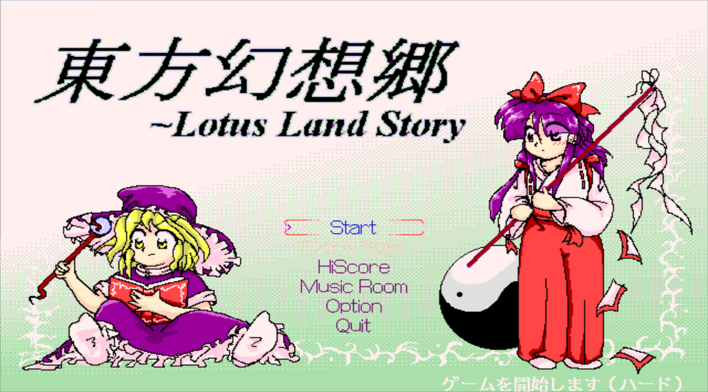
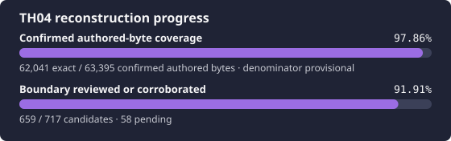

# 東方幻想郷 ～ Lotus Land Story

<p align="center">
  
</p>

<p align="center">
  
</p>

This repository reconstructs the original Japanese PC-98 **Touhou 4:
Lotus Land Story**. The active goal is to build `MAIN.EXE`, `OP.EXE`,
`MAINE.EXE` and `ZUN.COM` from maintained TH04 source and run the full game.
Native builds need not reproduce the original executable bytes. MAIN's two
remaining historical exactness cases are deferred.

[Current state and remaining work](docs/RE_HANDOFF.md) is the working entrypoint.
Historical function acceptance is reported by `python3 scripts/status.py` and
[PROGRESS.md](docs/PROGRESS.md); it is separate from gameplay completion.

## Current products and navigation

Development is active. All four DOS products build from maintained local source.
Retained original/reconstructed DOS comparisons agree across all four bundled
demos on consumed input, score and RNG, nine complete actor/effect pools, and 22
Boss/Midboss/player state blocks. These demos exercise Midboss fights; Boss
combat, death/respawn and complete process transitions still need paired
validation. New complete raw video captures cover both graphics pages, all four
planes, text, palettes and selected GDC display fields. Text, palettes and the
compared display fields agree. Cold builds and complete replays verify repairs
to the Stage 4 carpet columns and packed bullet invalidation dimensions.
Demo 2 and Demo 3 now agree on every compared video region across all 3,996
updates each. Remaining graphics differences start at frame-counter writes
1678 in Demo 1 and 1349 in Demo 4. Full scanout timing and the remaining drawing
causes are still open; see the handoff for the current evidence.

Native x64 source lives on `port/modern-64`. Scoped Linux Reimu A runs cover
Normal, Lunatic and Extra clears with registration, physical saves and fresh
OP/restart checks. Full original-DOS/native state and effect parity, broader
routes, and physical Windows input/audio acceptance remain open. Historical
exact acceptance has its own contract; runtime agreement does not promote it.

- [Current DOS/native evidence and remaining work](docs/PORTING_STATUS.md).
- [DOS build and normal/invincible Windows testing](docs/DOS_BUILD.md).
- [Reusable PC-98 hardware fixes and measured optimizations](docs/PC98_HARDWARE_REUSE.md).
- [Script purposes and categorized indexes](scripts/README.md).
- [Private tools, caches and cleanup recovery](docs/ANALYSIS_RETENTION.md).

## Build and run

With local inputs and the toolchain installed:

```sh
python3 scripts/preflight.py
python3 scripts/build.py
# Outputs: .analysis/build/th04/{MAIN.EXE,OP.EXE,MAINE.EXE,ZUN.COM}
python3 scripts/prepare_product_hdi.py \
  --output-dir .analysis/runtime/candidates/NEW-game
xvfb-run -a python3 scripts/probes/run_th04_maine_diagnostic_hdi.py \
  --prepared-dir .analysis/runtime/candidates/NEW-game \
  --output-dir .analysis/runtime/candidates/NEW-game/run \
  --frame-second 60 --time-limit 75
```

Run one Borland/Wine build at a time. `--only main` selects one product;
`--main-cpp-cache PATH` reuses objects only when their inputs match a prior MAIN
build. A fresh build is the final source-migration check. The build rejects
compiler/linker failures and publishes outputs after all requested products
succeed. Runtime validation remains separate.

Image preparation modifies a disposable copy of your supplied original-data
image. Original executables and game assets are never committed.

## Setup

The build uses pinned Turbo C++ 4.0J, TASM and TLINK under Wine. ReC98 supplies
the pinned MS-DOS Player and local sprite conversion inputs; product source
and headers live in this repository and do not use `masters.lib`.

```sh
mkdir -p _reference
git clone https://github.com/nmlgc/ReC98.git _reference/ReC98
git -C _reference/ReC98 checkout --detach b6ba5b0a529edbb31efdf8c0e939263804f8ee47
python3 scripts/import_targets.py /path/to/your/legal-copy.rar \
  --retain-runtime-image
bash scripts/bootstrap_toolchain.sh
python3 scripts/preflight.py
```

Host tools include Python 3, Wine, archive utilities and, for runtime checks,
the pinned DOSBox-X build plus Xvfb, xdotool and ImageMagick. See
[RUNTIME.md](docs/RUNTIME.md) for emulator setup. Analysis/database work also
uses `bootstrap_analysis_toolchain.sh` and `scripts/ghidra.py`.

## Local inputs

Supply your own legal copy.  The importer selects the Japanese `zun.hdi` and
requires these artifacts:

| Artifact | Size | SHA-256 |
| --- | ---: | --- |
| `OP.EXE` | 42,290 | `8fc3b67fa8470de15b4f2844d5623d0a93d7922fac16d82a25a90a378b516b0f` |
| `MAIN.EXE` | 156,258 | `077440a3c4e9ab52e72e9bae411276c47edc11995b5c2b83dfc83fbc039dc58b` |
| `MAINE.EXE` | 38,035 | `670de6ba907a2edbc1592de810acd92e5b89541d3dc35b70210171166d1713f8` |
| `ZUN.COM` | 7,754 | `0a12e9a489d3b704a77cf04ca3062ee48f298a9df6d237dc7dad46986e2d116e` |

These hashes currently have `candidate-local-attested` provenance: they
identify the supplied Japanese image exactly, while independent pristine-dump
confirmation remains open.  That qualification is kept separate from whether
a candidate build exactly matches the pinned bytes.

## Source and validation

Source belongs under `src/main/`, `src/op/`, `src/maine/`, `src/zun/` and
`src/shared/`, organized by subsystem. See [SOURCE_LAYOUT.md](docs/SOURCE_LAYOUT.md)
and [ARCHITECTURE.md](docs/ARCHITECTURE.md). ReC98 implementations are migration
inputs; their progress and exactness claims do not transfer automatically.

Use [RE_WORKFLOW.md](docs/RE_WORKFLOW.md) for implementation work. Install public
validation dependencies with `python3 -m pip install -r requirements-ci.txt`;
CI also checks out the pinned ReC98 source-routing reference used by the manifest
audit; this is a validation input, not a product include dependency. Private
CPU/runtime Oracles additionally require their documented local tools. Finish with:

```sh
python3 scripts/ci.py
git diff --check
```

Historical evidence is routed through [the reconstruction index](docs/reconstruction/README.md),
`config/units.csv` and `config/evidence.csv`. [ORACLES.md](docs/ORACLES.md)
defines the separate byte-exact acceptance contract. Local tools, targets,
images, builds and reports remain in ignored directories.

## License

Repository-authored code and documentation are provided under the MIT License.
This does not grant rights to the original game, its assets, or referenced
third-party work.
